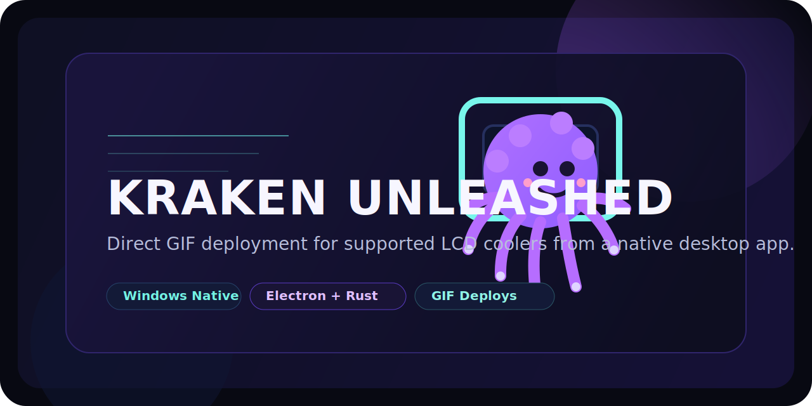

<p align="center">
  
</p>

<h1 align="center">Kraken Unleashed</h1>

<p align="center">
  Direct GIF deployment for supported LCD coolers from a native desktop app.
</p>

<p align="center">
  Windows-native device control | Placement editor | Rust-powered deploy pipeline
</p>

Kraken Unleashed is a desktop app for pushing animated GIFs directly to supported Kraken LCD coolers. The workflow is intentionally simple: detect the device, line up the asset, and deploy it to the screen without bouncing through a bloated setup.

This project is independent and is not affiliated with or endorsed by NZXT.

## Why It Exists

Most cooler LCD workflows feel heavier than they need to be. Kraken Unleashed focuses on the part that matters:

- detect the display
- preview and position the GIF
- write it cleanly to the device
- recover fast if the screen gets stuck

## Highlights

- direct GIF deploys over USB
- native device detection from the desktop app
- brightness control, LCD shutdown, and restore-liquid recovery actions
- placement editor with saved zoom, pan, and rotation presets per GIF
- local gallery workflow for uploaded assets
- Rust backend helper for device-facing operations

## Current Status

- platform target: Windows
- media support today: GIF only
- native backend actions: `info`, `brightness`, `recover`, and `write`
- validated hardware: `Kraken Elite RGB 2024` / `Kraken Elite V2` (`PID 0x3012`)

The app prepares device-ready GIFs locally, stages them in `.electron-data`, then writes them to the LCD through the Rust helper.

## Supported Devices

Validated in this app:

- `Kraken Elite RGB 2024` / `Kraken Elite V2` (`PID 0x3012`)

Also listed in the compatibility view:

- `Kraken Elite 2023` (`PID 0x300C`) - supported backend path
- `Kraken Z3` (`PID 0x3008`) - legacy support path

## Quick Start

### Requirements

- Windows
- Node.js with `npm`
- Rust toolchain with `cargo`
- a supported Kraken LCD connected over USB

For release packaging, use Node.js `22.x` so the Electron packaging toolchain matches CI.

### Run the app

From the repo root:

```bash
npm install
npm run backend:stage
npm start
```

`npm run backend:stage` builds the Rust helper and stages it where Electron will find it first.

### Build a packaged Windows app

From the repo root:

```bash
npm install
npm run dist:win
```

This produces Windows release artifacts in `dist/` and bundles the Rust backend into the packaged app under `resources/backend/`.

## Workflow

1. Launch the app and let it detect the connected LCD.
2. Upload a GIF and select it from the local gallery.
3. Open the editor to adjust zoom, pan, and rotation.
4. Deploy the prepared GIF to the display.
5. Use `Restore Liquid Screen` if the LCD needs a clean reset.

## Backend Notes

The Electron app prefers a compiled Rust backend helper. The helper currently exposes these native commands:

- `info` - detect a supported Kraken LCD and report resolution details
- `brightness` - set LCD brightness from `0` to `100`
- `recover` - switch the screen back to the liquid display mode
- `write` - prepare and transfer a GIF directly to the device

Useful commands while developing:

```bash
cargo build --manifest-path backend-rust/Cargo.toml
cargo build --release --manifest-path backend-rust/Cargo.toml
npm run backend:stage
npm run dist:win
```

You can also point Electron at a custom helper binary with:

```bash
set KRAKEN_RUST_BACKEND_BIN=C:\full\path\to\kraken-unleashed-backend.exe
```

## Safety Notes

- this app writes directly to the LCD device over USB
- use it at your own risk
- keep competing control software closed while deploying
- non-GIF modes are not implemented yet, even if they appear in the roadmap

## Release Automation

GitHub Actions packaging is defined in [`.github/workflows/release.yml`](./.github/workflows/release.yml).

- every merge to `main` builds the Windows installer, generates `SHA256SUMS.txt`, and updates the rolling `edge` prerelease on GitHub
- pushing a tag like `v1.0.0` builds the same installer assets and publishes a stable GitHub release for that tag
- the workflow validates that the pushed stable tag matches `package.json` version before publishing
- pull requests into `main` are validated by [`.github/workflows/ci.yml`](./.github/workflows/ci.yml)

The release job uses `electron-builder`, bundles the Rust backend from `dist-resources/backend`, and writes user data to the normal Electron `userData` location instead of the install directory.

## Versioning

Use SemVer for stable releases:

- `v1.0.1` for fixes and packaging-only updates
- `v1.1.0` for new user-facing features or support for more devices without breaking existing flows
- `v2.0.0` for breaking changes in packaging, CLI behavior, config layout, or compatibility expectations

Recommended release model:

- `main` is always releasable and publishes the rolling `edge` prerelease automatically
- stable releases happen only when you intentionally bump `package.json` and create a matching `vX.Y.Z` tag
- the GitHub release assets are the installer, metadata files, and `SHA256SUMS.txt` so users can download and verify what they install

### Optional VirusTotal scan

If you add a repository secret named `VT_API_KEY`, the release workflow will upload the generated Windows installer to VirusTotal after packaging and attach a scan summary to the workflow run.

Notes:

- the VirusTotal step is optional and skipped when `VT_API_KEY` is not configured
- the workflow scans the installer artifact to keep the public API request count low
- if you need `libusb-1.0.dll` bundled explicitly, provide it before packaging or set `KRAKEN_LIBUSB_DLL` during the build

## Roadmap

- SignalRGB integration
- CLI support for scripted usage and automation
- loop controls to help organize and fine-tune perfect seamless GIF loops
- more modes beyond GIF-only, including slideshow, web integration, clock, text, and music mode
- broader cooler model support, with community contributions welcome for adding and validating more devices

## Contributing

Contributions are welcome, especially for expanding cooler support.

If you want to add or validate a new model, include as much of this as you can:

- exact cooler model name
- USB `VID` and `PID`
- detected screen resolution
- whether detection, brightness, recovery, and GIF deploy all work
- logs, screenshots, or short notes about anything unusual

Hardware validation from real devices is especially useful.

## License

Licensed under `AGPL-3.0-only`. See [LICENSE](./LICENSE).
