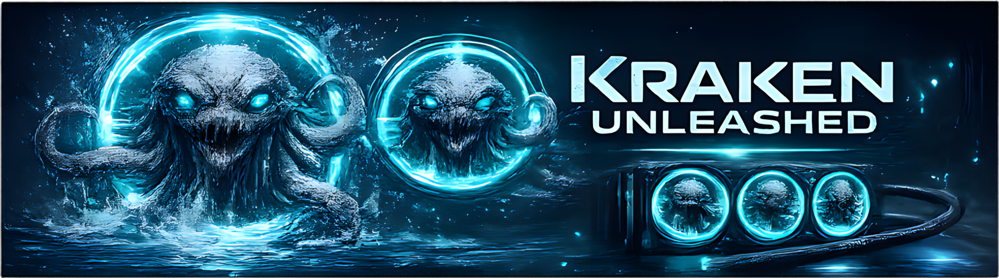

<p align="center">
  
</p>

<h1 align="center">Kraken Unleashed</h1>

<p align="center">
  The clean way to put custom GIFs on supported Kraken LCD coolers.
</p>

<p align="center">
  Fast deploy | Search GIF online | Fully Open Source
</p>

<p align="center">
  <a href="https://github.com/Cesarsk/kraken-unleashed/releases">Download for Windows</a>
  |
  <a href="#supported-devices">Supported Devices</a>
  |
  <a href="#build-from-source">Build From Source</a>
</p>

<p align="center">
  
</p>

Kraken Unleashed is a desktop app built for getting great-looking GIFs onto supported Kraken LCD coolers. Detect the screen, position the asset properly, deploy it and you are done

This project is independent and is not affiliated with or endorsed by NZXT.

## Why It Feels Better

- deploy GIFs is very easy and does not require official app.
- download GIFs via the App
- fully free
- save per-GIF zoom, pan, and rotation presets
- control brightness and recover the display from the same app
- keep a simple local gallery

Current status:

- platform target: Windows
- media support today: GIF only (more to come)
- native backend actions: `info`, `brightness`, `recover`, and `write`

## Download

If you just want to use the app, start with the latest Windows release:

- [Latest Releases](https://github.com/Cesarsk/kraken-unleashed/releases)

## Supported Devices

Validated in this app:

- `Kraken Elite RGB 2024` / `Kraken Elite V2` (`PID 0x3012`)

Also listed in the compatibility view:

- `Kraken Elite 2023` (`PID 0x300C`)
- `Kraken Z3` (`PID 0x3008`)

More device support is planned (not necessarly Kraken coolers), and community validation is welcome.

## Build From Source

### Requirements

- Windows
- Node.js with `npm`
- Rust toolchain with `cargo`
- a supported Kraken LCD connected over USB

For release packaging, use Node.js `22.x` so the Electron packaging toolchain matches CI.

### Run the app locally

From the repo root:

```bash
npm install
npm run backend:stage
npm start
```

`npm run backend:stage` builds the Rust helper and stages it where Electron will find it first.

## Safety Notes

- this app writes directly to the LCD device
- use it at your own risk, I am not responsible for any damage caused.
- keep competing control software closed while deploying

## Trust And Signing

Free code signing has been requested to [SignPath.io](https://about.signpath.io/), with a certificate from [SignPath Foundation](https://signpath.org/). It is pending as of now.

### Roles

- Committer and reviewer: [Cesarsk](https://github.com/Cesarsk)
- Approver: [Cesarsk](https://github.com/Cesarsk)

### Scope

Only official release artifacts built from the source code in this repository and published through this project's release process are eligible for signing.

### Privacy

Privacy policy: [PRIVACY.md](./PRIVACY.md)

## Roadmap

- SignalRGB integration
- CLI support for scripted usage and automation
- loop controls to help organize and fine-tune perfect seamless GIF loops
- more modes beyond GIF-only, including slideshow, web integration, clock, text, and music mode
- broader cooler model support, with community contributions welcome for adding and validating more devices

## Contributing

Contributions are welcome, especially for expanding cooler support.

If you want to add or validate a new model, include as much of this as you can:

- exact cooler model name
- USB `VID` and `PID`
- detected screen resolution
- whether detection, brightness, recovery, and GIF deploy all work
- logs, screenshots, or short notes about anything unusual

Hardware validation from real devices is especially useful.

## License

Licensed under `AGPL-3.0-only`. See [LICENSE](./LICENSE).
